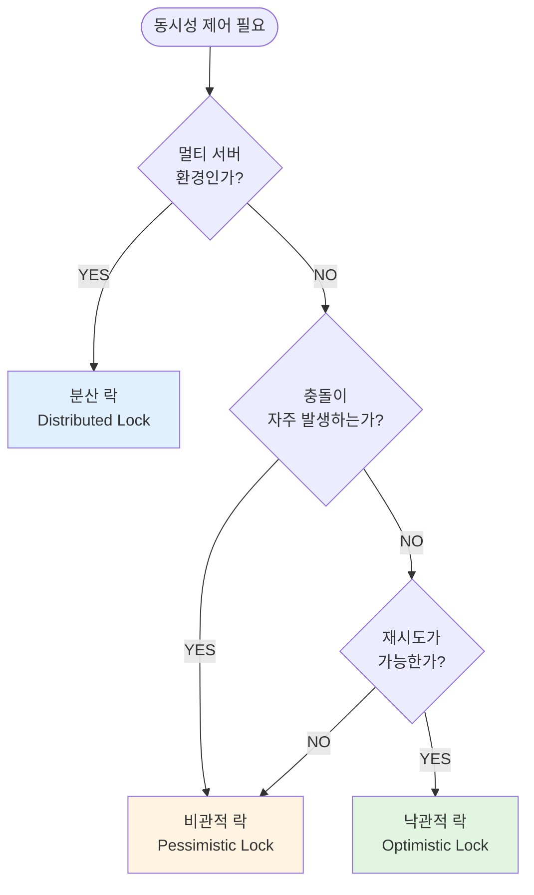

## 개요

프로젝트에서 동시성 문제를 해결하기 위해 낙관적 락을 적용한 적이 있었다. 하지만 서비스가 확장되면서 단일 서버 환경에서 멀티 서버 환경으로 전환까지 고려해야 했고, 기존의 락 전략만으로는 충분하지 않았다. 이때 비관적 락과 분산 락이라는 개념을 접하게 되었고, 각 락의 특징과 적절한 사용 시나리오에 대해 정리해보고자 한다.

## 락(Lock)이란?

락은 여러 트랜잭션이 동시에 같은 데이터에 접근할 때 데이터 일관성을 보장하기 위한 동시성 제어 메커니즘이다. 락을 사용하지 않으면 **Lost Update**(갱신 손실), **Dirty Read**(더티 리드) 같은 동시성 문제가 발생할 수 있다.

## 낙관적 락 (Optimistic Lock)

### 특징

낙관적 락은 **"충돌이 자주 발생하지 않을 것"**이라고 가정한다. 데이터베이스 레벨의 락을 걸지 않고, 애플리케이션 레벨에서 버전 정보를 이용해 충돌을 감지한다.

### 동작 방식

```kotlin
@Entity
class Product(
    @Id
    @GeneratedValue(strategy = GenerationType.IDENTITY)
    val id: Long? = null,

    var stock: Int,

    @Version  // 낙관적 락을 위한 버전 필드
    var version: Long? = null
)
```

1. 데이터를 읽을 때는 락을 걸지 않는다
2. 데이터 수정 시 버전을 체크한다
3. 버전이 다르면 `OptimisticLockingFailureException` 발생

### 장점

- **성능**: 락으로 인한 대기 시간이 없다
- **데드락 없음**: DB 레벨의 락을 사용하지 않아 데드락이 발생하지 않는다
- **높은 처리량**: 읽기 작업이 많은 환경에서 유리하다

### 단점

- **재시도 필요**: 충돌 발생 시 애플리케이션에서 재시도 로직을 구현해야 한다
- **충돌 빈번 시 비효율**: 충돌이 자주 발생하면 재시도가 많아져 성능 저하

### 사용 시나리오

```kotlin
@Service
class ProductService(
    private val productRepository: ProductRepository
) {
    @Transactional
    fun updateStock(productId: Long, quantity: Int) {
        val product = productRepository.findById(productId)
            .orElseThrow { IllegalArgumentException("상품을 찾을 수 없습니다.") }

        product.stock += quantity
        productRepository.save(product)  // 버전 체크
    }
}
```

**적합한 경우**

- 읽기 작업이 많고 쓰기 작업이 적은 경우
- 충돌이 드물게 발생하는 경우
- 단일 서버 환경
- 재고 조회, 게시글 조회수 증가 등

## 비관적 락 (Pessimistic Lock)

### 특징

비관적 락은 **"충돌이 자주 발생할 것"**이라고 가정한다. 데이터를 읽는 시점에 DB 레벨의 락을 걸어 다른 트랜잭션의 접근을 막는다.

### 동작 방식

```kotlin
interface ProductRepository : JpaRepository<Product, Long> {

    @Lock(LockModeType.PESSIMISTIC_WRITE)
    @Query("SELECT p FROM Product p WHERE p.id = :id")
    fun findByIdWithLock(@Param("id") id: Long): Optional<Product>
}
```

**실행되는 SQL:**

```sql
SELECT * FROM product
WHERE id = 1
FOR UPDATE;  -- 다른 트랜잭션은 대기
```

### 락 모드 종류

**PESSIMISTIC_READ (공유 락, Shared Lock)**

- 다른 트랜잭션의 읽기는 허용, 쓰기는 차단
- `SELECT ... FOR SHARE` (MySQL 8.0+)

**PESSIMISTIC_WRITE (배타 락, Exclusive Lock)**

- 다른 트랜잭션의 읽기/쓰기 모두 차단
- `SELECT ... FOR UPDATE`

**PESSIMISTIC_FORCE_INCREMENT**

- 버전 정보를 강제로 증가시키며 배타 락 획득

### 장점

- **데이터 일관성 보장**: 확실하게 충돌을 방지한다
- **재시도 불필요**: 락을 획득한 트랜잭션만 처리되므로 재시도 로직이 필요 없다
- **예측 가능**: 동시성 제어 동작을 명확하게 예측할 수 있다

### 단점

- **성능 저하**: 락 대기로 인한 처리 속도 감소
- **데드락 위험**: 여러 락을 동시에 획득할 때 데드락 발생 가능
- **확장성 제한**: 대기 시간이 길어질 수 있어 처리량 감소

### 사용 시나리오

```kotlin
@Service
class TicketService(
    private val ticketRepository: TicketRepository
) {
    @Transactional
    fun reserveTicket(ticketId: Long, userId: Long) {
        // 락을 걸고 티켓 조회
        val ticket = ticketRepository.findByIdWithLock(ticketId)
            .orElseThrow { IllegalArgumentException("티켓을 찾을 수 없습니다.") }

        require(!ticket.isReserved) { "이미 예약된 티켓입니다." }

        ticket.reserve(userId)
        ticketRepository.save(ticket)
        // 트랜잭션 종료 시 락 해제
    }
}
```

**적합한 경우**

- 충돌이 자주 발생하는 경우
- 재시도 비용이 큰 경우
- 단일 서버 환경
- 티켓 예매, 한정 수량 상품 구매, 계좌 이체 등

## 분산 락 (Distributed Lock)

### 특징

분산 락은 **여러 서버 인스턴스 간의 동시성을 제어**하기 위한 메커니즘이다. 단일 서버의 낙관적/비관적 락은 같은 DB 연결을 공유하는 트랜잭션 간에만 동작하지만, 분산 락은 서로 다른 서버 인스턴스 간에도 동시성을 제어할 수 있다.

### Redis를 이용한 분산 락 (feat. Lua script)

```kotlin
@Component
class RedisLockManager(
    private val redisTemplate: RedisTemplate<String, String>
) {
    fun <T> executeWithLock(
        key: String,
        waitTime: Long = 5000,
        leaseTime: Long = 3000,
        block: () -> T
    ): T {
        val lockKey = "lock:$key"
        val lockValue = UUID.randomUUID().toString()

        try {
            // 락 획득 시도
            val acquired = tryLock(lockKey, lockValue, leaseTime)

            if (!acquired) {
                throw RuntimeException("락 획득 실패")
            }

            // 비즈니스 로직 실행
            return block()
        } finally {
            // 락 해제
            unlock(lockKey, lockValue)
        }
    }

    private fun tryLock(key: String, value: String, leaseTime: Long): Boolean {
        return redisTemplate.opsForValue()
            .setIfAbsent(key, value, leaseTime, TimeUnit.MILLISECONDS) ?: false
    }

    private fun unlock(key: String, value: String) {
        val script = """
            if redis.call('get', KEYS[1]) == ARGV[1] then
                return redis.call('del', KEYS[1])
            else
                return 0
            end
        """.trimIndent()

        redisTemplate.execute(
            RedisScript.of(script, Long::class.java),
            listOf(key),
            value
        )
    }
}
```

### Redisson을 이용한 간편한 구현

```kotlin
@Service
class OrderService(
    private val redissonClient: RedissonClient,
    private val productRepository: ProductRepository
) {
    fun purchaseWithDistributedLock(productId: Long, quantity: Int) {
        val lock = redissonClient.getLock("product:$productId")

        try {
            // 락 획득 시도 (최대 5초 대기, 3초 후 자동 해제)
            val acquired = lock.tryLock(5, 3, TimeUnit.SECONDS)

            if (!acquired) {
                throw RuntimeException("락 획득 실패")
            }

            // 비즈니스 로직
            val product = productRepository.findById(productId)
                .orElseThrow { IllegalArgumentException("상품을 찾을 수 없습니다.") }

            require(product.stock >= quantity) { "재고가 부족합니다." }

            product.stock -= quantity
            productRepository.save(product)

        } finally {
            if (lock.isHeldByCurrentThread) {
                lock.unlock()
            }
        }
    }
}
```

### 장점

- **멀티 서버 환경 지원**: 여러 서버 인스턴스 간 동시성 제어
- **독립적인 락 관리**: DB와 독립적으로 락을 관리
- **타임아웃 설정**: 락 대기 시간과 보유 시간을 명시적으로 설정 가능

### 단점

- **복잡도 증가**: Redis 같은 외부 시스템 필요
- **네트워크 지연**: 네트워크 통신으로 인한 오버헤드
- **장애 가능성**: Redis 장애 시 락 기능 전체 중단
- **관리 비용**: Redis 클러스터 운영 및 모니터링 필요

### 주의사항

**1. 락 타임아웃 설정**

```kotlin
// 잘못된 예: 락이 영구적으로 유지될 수 있음
lock.lock()

// 올바른 예: 타임아웃 설정
lock.tryLock(5, 3, TimeUnit.SECONDS)
```

**2. 락 해제 보장**

```kotlin
// 반드시 finally 블록에서 락 해제
try {
    lock.lock()
    // 비즈니스 로직
} finally {
    if (lock.isHeldByCurrentThread) {
        lock.unlock()
    }
}
```

**3. 재진입(Reentrant) 처리**

```kotlin
// Redisson은 재진입 가능한 락 제공
val lock = redissonClient.getLock("myLock")
lock.lock()  // 첫 번째 획득
lock.lock()  // 같은 스레드에서 다시 획득 가능
lock.unlock()
lock.unlock()  // 획득한 횟수만큼 해제 필요
```

### 사용 시나리오

**적합한 경우:**

- **멀티 서버 환경**: 여러 서버 인스턴스가 동시에 실행되는 환경
- **높은 동시성**: 동시 접근이 매우 빈번한 경우
- **크리티컬한 작업**: 선착순 이벤트, 쿠폰 발급, 포인트 적립 등
- **DB와 독립적인 락**: DB 부하를 줄이고 싶을 때

## 세 가지 락 비교

### 성능 비교

| 항목        | 낙관적 락 | 비관적 락 | 분산 락                  |
| ----------- | --------- | --------- | ------------------------ |
| 처리 속도   | 빠름      | 중간      | 느림 (네트워크 오버헤드) |
| 대기 시간   | 없음      | 있음      | 있음                     |
| 재시도      | 필요      | 불필요    | 불필요                   |
| 데드락 위험 | 없음      | 있음      | 있음                     |

### 적용 환경 비교

| 항목        | 낙관적 락 | 비관적 락 | 분산 락       |
| ----------- | --------- | --------- | ------------- |
| 서버 환경   | 단일 서버 | 단일 서버 | **멀티 서버** |
| 충돌 빈도   | 낮음      | 높음      | 높음          |
| 읽기/쓰기   | 읽기 위주 | 쓰기 위주 | 쓰기 위주     |
| 구현 복잡도 | 낮음      | 낮음      | **높음**      |

### 사용 시나리오 비교

**낙관적 락**

- 게시글 조회수 증가
- 좋아요 수 업데이트
- 상품 정보 수정
- 사용자 프로필 업데이트

**비관적 락**

- 재고 차감 (단일 서버)
- 계좌 잔액 업데이트
- 예약 시스템 (단일 서버)
- 순번 발급

**분산 락**

- 선착순 이벤트 (멀티 서버)
- 한정 수량 쿠폰 발급
- 포인트 적립/차감 (멀티 서버)
- 재고 관리 (멀티 서버)

## 실전 예제: 재고 관리 시스템

### 시나리오별 구현

**1. 낙관적 락: 충돌이 적은 일반 상품**

```kotlin
@Service
class GeneralProductService(
    private val productRepository: ProductRepository
) {
    @Retryable(
        value = [OptimisticLockingFailureException::class],
        maxAttempts = 3,
        backoff = Backoff(delay = 100)
    )
    @Transactional
    fun purchase(productId: Long, quantity: Int) {
        val product = productRepository.findById(productId)
            .orElseThrow { IllegalArgumentException("상품을 찾을 수 없습니다.") }

        product.decreaseStock(quantity)
        productRepository.save(product)
    }
}
```

**2. 비관적 락: 인기 상품 (단일 서버)**

```kotlin
@Service
class PopularProductService(
    private val productRepository: ProductRepository
) {
    @Transactional
    fun purchase(productId: Long, quantity: Int) {
        val product = productRepository.findByIdWithLock(productId)
            .orElseThrow { IllegalArgumentException("상품을 찾을 수 없습니다.") }

        product.decreaseStock(quantity)
        productRepository.save(product)
    }
}
```

**3. 분산 락: 한정판 상품 (멀티 서버)**

```kotlin
@Service
class LimitedProductService(
    private val redissonClient: RedissonClient,
    private val productRepository: ProductRepository
) {
    fun purchase(productId: Long, quantity: Int) {
        val lock = redissonClient.getLock("limited:product:$productId")

        try {
            val acquired = lock.tryLock(5, 3, TimeUnit.SECONDS)
            require(acquired) { "현재 많은 요청이 있습니다. 잠시 후 다시 시도해주세요." }

            purchaseInternal(productId, quantity)

        } finally {
            if (lock.isHeldByCurrentThread) {
                lock.unlock()
            }
        }
    }

    @Transactional
    fun purchaseInternal(productId: Long, quantity: Int) {
        val product = productRepository.findById(productId)
            .orElseThrow { IllegalArgumentException("상품을 찾을 수 없습니다.") }

        product.decreaseStock(quantity)
        productRepository.save(product)
    }
}
```

## 락 선택 가이드

### 의사결정 플로우



### 체크리스트

**낙관적 락을 선택해야 하는 경우**

- ✅ 단일 서버 환경
- ✅ 읽기 작업이 쓰기 작업보다 훨씬 많음
- ✅ 충돌 빈도가 낮음
- ✅ 재시도 로직 구현 가능
- ✅ 성능이 가장 중요함

**비관적 락을 선택해야 하는 경우**

- ✅ 단일 서버 환경
- ✅ 충돌 빈도가 높음
- ✅ 재시도 비용이 큼
- ✅ 데이터 일관성이 매우 중요함
- ✅ 트랜잭션이 짧음

**분산 락을 선택해야 하는 경우**

- ✅ 멀티 서버 환경
- ✅ 서버 인스턴스 간 동시성 제어 필요
- ✅ Redis 같은 외부 저장소 사용 가능
- ✅ 운영 복잡도 증가 감수 가능

## 마치며

프로젝트 초기에는 낙관적 락으로 충분했지만, 서비스가 성장하고 멀티 서버 환경으로 확장되면서 분산 락의 필요성을 느꼈다. 각 락 메커니즘은 장단점이 명확하고, 상황에 따라 적절한 선택이 달라진다.

중요한 것은 **"무조건 이것이 좋다"는 없다는 점**이다. 본인이 서비스의 특성, 서버 환경, 트래픽 패턴, 비즈니스 요구사항을 종합적으로 고려해서 선택해야 한다. 때로는 하나의 서비스 내에서도 기능별로 다른 락 전략을 사용하는 것이 더 효율적일 수 있다.

동시성 제어는 예상치 못한 버그를 만들 수 있는 영역이다. 충분한 테스트와 모니터링을 통해 선택한 락 전략이 올바르게 동작하는지 검증하는 것이 중요하다.

**핵심 정리**

- **낙관적 락**: 충돌이 적고 성능이 중요한 단일 서버 환경
- **비관적 락**: 충돌이 많고 일관성이 중요한 단일 서버 환경
- **분산 락**: 멀티 서버 환경에서 서버 간 동시성 제어 필요 시
- 상황에 맞는 락 선택이 서비스 품질과 성능에 직접적인 영향을 미친다
